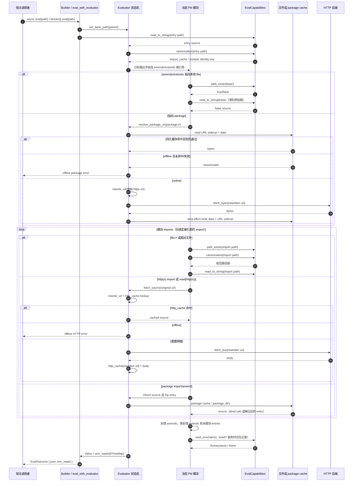

# pklr evaluate 执行路径交底

基线 commit：`2d60de508d321688f65a58422be39b858de7f499`。本文行号对应基线中的 `src/lib.rs`、`src/eval.rs`、`src/capabilities.rs`；新增证明代码 `tests/trace.rs` 是本次工作树中的离线测试，行号对应该文件当前内容。

## 1. 先给结论

- 同步和异步公共 evaluate 入口最终都进入同一个 `eval_with_evaluator`：异步 builder 直接 `await`，同步 builder 用 `pollster::block_on` 驱动同一个 future（`src/lib.rs:188`、`src/lib.rs:264`、`src/lib.rs:325`）。
- 两条评估路径共享同一个 `Evaluator` 状态机：本地路径规范化、本地 import 缓存、amends/extends 的 in-flight 保护、HTTP/package 缓存和环境变量记录都在 `src/eval.rs` 中，而不是分别实现（`src/eval.rs:115`、`src/eval.rs:191`、`src/eval.rs:590`、`src/eval.rs:663`）。
- 默认 capability 后端不同：异步入口安装 `NativeCapabilities`，同步入口安装 `BlockingCapabilities`；差异位于宿主 IO/HTTP 客户端层，而不是 URI、缓存或求值顺序层（`src/lib.rs:161`、`src/lib.rs:240`、`src/eval.rs:111`、`src/capabilities.rs:173`、`src/capabilities.rs:436`）。
- 普通 `import` 的绑定处理先于 amend 值继承；但模块会先为 amends/extends 的根引用做源码预加载，因此实际 capability 读文件顺序可能早于普通 import（`src/eval.rs:764`、`src/eval.rs:780`、`src/eval.rs:978`、`src/eval.rs:1090`）。
- rewrite 只作用于实际网络 URL：普通 HTTP 用 rewrite 后 URL 作为内存缓存键；package 先把 `package://` 解析成原始 HTTPS URL，并用原始 URL 做持久缓存键，只在网络抓取前 rewrite（`src/eval.rs:299`、`src/eval.rs:307`、`src/eval.rs:422`、`src/eval.rs:446`、`src/eval.rs:458`）。
- offline 只允许 package 走持久缓存；未命中 package 时在任何 `fetch_bytes` 前返回错误。普通 HTTP 的内存缓存先于 offline 判定，所以同一 evaluator 已抓到的 HTTP 文本在 offline 下仍可读（`src/eval.rs:309`、`src/eval.rs:312`、`src/eval.rs:423`、`src/eval.rs:436`）。
- 环境依赖通过 `EvalOutcome.env_reads` 回传，类型为按名称排序的 `BTreeMap`，缺失变量也保留为 `None`。capability 调用次数可能因重复求值增加，但返回给调用者的依赖集按变量名去重（`src/lib.rs:39`、`src/eval.rs:274`、`src/eval.rs:275`、`src/eval.rs:187`）。

## 2. 宿主调用、模块请求与 capability 回应



这个实现没有启动外部 Pkl 进程；“Pkl 模块请求”是 `Evaluator` 对 trait object `Box<dyn EvalCapabilities>` 的进程内 async 调用（`src/eval.rs:32`、`src/capabilities.rs:17`）。

## 3. 公共 evaluate API 如何汇合

### 异步入口

- `eval_to_json_async(path)` 调 `eval_to_json_with_client_async(path, None)`（`src/lib.rs:52`）。
- 带 options 的入口创建 `AsyncEvaluatorBuilder`，写入 rewrite 和可选 reqwest client，然后调用 builder 的 `eval`（`src/lib.rs:299`）。
- `AsyncEvaluatorBuilder::build` 创建 `Evaluator::new_async()`，后者安装 `NativeCapabilities`；随后设置 client、rewrite、cache 目录、offline，并顺序执行预加载（`src/lib.rs:161`、`src/eval.rs:109`）。
- builder 的 `eval` 构建 evaluator 后进入共享的 `eval_with_evaluator`（`src/lib.rs:187`）。

### 同步入口

- `eval_to_json(path)` 创建默认 `EvaluatorBuilder`（`src/lib.rs:46`）。
- `EvaluatorBuilder::build` 总是安装 `BlockingCapabilities`，再设置同样的 rewrite、cache、offline 和预加载（`src/lib.rs:239`）。
- 同步 `eval` 用 `pollster::block_on(eval_with_evaluator(...))`，没有第二套求值代码（`src/lib.rs:262`）。
- 阻塞预加载 `Evaluator::preload_package` 也只是用 pollster 驱动 `preload_package_async`（`src/eval.rs:521`）。

### 共享尾部

`eval_with_evaluator` 依次把 base path 设为入口文件父目录、调用 `eval_file_pub`、应用 converter，最后把 JSON 和 `take_env_reads()` 的结果装入 `EvalOutcome`（`src/lib.rs:325`）。

每次 `eval_file_pub` 都先 `begin_evaluation`，再通过 capability 读取入口源码（`src/eval.rs:580`）。清理范围包括 `env_reads`、`import_cache`、`module_scopes`、`scoped_imports_in_flight` 和 converters（`src/eval.rs:191`）；不清理 `http_cache`、`package_dirs`、`package_http_roots`、rewrite、offline 和 package cache 目录，这些字段定义在 evaluator 上（`src/eval.rs:22`、`src/eval.rs:34`、`src/eval.rs:37`、`src/eval.rs:41`、`src/eval.rs:43`）。

## 4. URI 解析的真实顺序

### 4.1 模块进入与懒加载

入口文件由 `eval_file_pub` 通过 `read_to_string` 读取，然后 lex/parse 并以 depth 0 调 `eval_module_with_scope`（`src/eval.rs:581`、`src/eval.rs:570`、`src/eval.rs:572`）。

模块体不会无条件加载所有 import。求值器先由输出相关 entries 计算 `referenced_imports`，再并入 amends/extends 继承链的根引用；普通 import 的别名不在集合中时直接跳过，本地文件甚至不会检查存在性（`src/eval.rs:759`、`src/eval.rs:764`、`src/eval.rs:765`、`src/eval.rs:945`）。

在普通 import 循环前，amends/extends 的本地路径已经通过 `local_module_path` 收集，用于稍后把与基模相同的普通 import 延迟绑定到基模结果（`src/eval.rs:771`、`src/eval.rs:953`、`src/eval.rs:960`）。

### 4.2 相对、`file://` 与远程相对 URI

- 普通 import 先调用 `resolve_remote_relative`；如果当前模块路径不是 `http://` 或 `https://`，且 URI 自带 scheme 或为 `pkl:`，该函数返回 `None`，保持原 URI（`src/eval.rs:780`、`src/eval.rs:6525`）。
- 远程模块中的无 scheme URI 用 `url::Url::join` 相对当前 URL 解析（`src/eval.rs:6536`）。
- 本地普通路径经 `resolve_local_path` 相对当前文件父目录连接；`file://` 前缀在 import/amend 分支被剥离成 `PathBuf`，不会经过 URL crate（`src/eval.rs:140`、`src/eval.rs:153`、`src/eval.rs:933`、`src/eval.rs:1058`）。
- 本地模块身份和 `import_cache` 键来自 capability 的 `canonicalize`；失败时 `module_type_namespace` 退回原路径（`src/eval.rs:156`、`src/eval.rs:590`）。
- `read("file://...")` 是资源读取分支，只剥离前缀后直接 `read_to_string`；它不经过 `import_cache` 或模块求值（`src/eval.rs:266`、`src/eval.rs:268`、`src/eval.rs:270`）。

### 4.3 import 分支

普通 import 在同一个循环内按 scheme 分流：

1. glob import 先处理；远程 glob 绑定空对象，本地 glob 通过 capability `glob` 后逐个评估（`src/eval.rs:785`、`src/eval.rs:795`、`src/eval.rs:801`）。
2. `http://`/`https://` import 调 `fetch_source`，以 URL 作为模块路径递归求值（`src/eval.rs:818`、`src/eval.rs:832`、`src/eval.rs:836`）。
3. `package://` import 先 `resolve_package_uri`；zip 包解压后按本地文件求值，direct `.pkl` 包作为 HTTP source 求值（`src/eval.rs:850`、`src/eval.rs:868`、`src/eval.rs:871`、`src/eval.rs:896`）。
4. `pkl:` import 绑定内置 stdlib 值（`src/eval.rs:914`）。
5. 其他带 `://` 且不是 `file://` 的 import 被跳过（`src/eval.rs:928`）。
6. 本地或 `file://` import 先 `path_exists`，再按是否与 amends/extends 基模同路径决定延迟绑定或立即评估（`src/eval.rs:933`、`src/eval.rs:950`、`src/eval.rs:960`、`src/eval.rs:966`）。

### 4.4 amend 与 extends

amend 在 imports 之后处理，且先把相对 URI 通过同一个 `resolve_remote_relative` 转成远程绝对 URL 或保留本地 URI（`src/eval.rs:975`、`src/eval.rs:978`、`src/eval.rs:980`）。随后分别支持 HTTP、package zip、package direct 和本地/file：

- HTTP amend 直接 fetch、parse，并带着当前 scope clone 递归评估（`src/eval.rs:982`、`src/eval.rs:984`、`src/eval.rs:987`）。
- package zip amend 从 `package_dirs` 指向的临时目录读 entry，再以本地路径评估（`src/eval.rs:1001`、`src/eval.rs:1006`、`src/eval.rs:1008`）。
- direct package amend 调 `fetch_direct_package_source`，以解析后的 HTTPS URL 作为模块路径（`src/eval.rs:1035`、`src/eval.rs:1036`、`src/eval.rs:1042`）。
- 本地/file amend 先 `path_exists`，再走 `eval_file_with_scope`，这是和普通 import 不同的第二套循环保护（`src/eval.rs:1055`、`src/eval.rs:1063`、`src/eval.rs:1065`）。

第一次 amend 值加载后，代码又调用 `load_module_source` 重新取一次源码，用于注入基模 class 和 converter；这个第二阶段会再次产生文件或 package capability 请求（`src/eval.rs:1090`、`src/eval.rs:1093`、`src/eval.rs:1101`、`src/eval.rs:1125`）。

extends 在 amend 阶段之后处理；本地 extends 与本地 amend 一样走 `eval_file_with_scope`，远程 extends 在这段本地分支中不会按文件处理（`src/eval.rs:1140`、`src/eval.rs:1144`、`src/eval.rs:1150`、`src/eval.rs:1152`）。

### 4.5 package URI 形态

`resolve_package_uri` 接受四类形态：

- `package://pkg.pkl-lang.org/github.com/{repo}@{version}#/file.pkl` → direct GitHub release 文件 URL（`src/eval.rs:5722`）。
- `package://pkg.pkl-lang.org/pkl-pantry/{package}@{version}#/file.pkl` → pkl-pantry release zip（`src/eval.rs:5735`）。
- `package://github.com/...#/file.pkl` → `{base}.zip`（`src/eval.rs:5749`）。
- 其他非 `pkg.pkl-lang.org` 主机的 package URI → 通用 `https://{base}.zip`（`src/eval.rs:5758`）。

fragment entry 禁止空路径、反斜杠和 `..` segment，以避免 zip slip（`src/eval.rs:5696`、`src/eval.rs:5700`、`src/eval.rs:5706`）。

## 5. rewrite 何时生效

规则由 `set_http_rewrites` 解析：每个规则必须在第一个 `=` 处拆成非空 source prefix 和 target prefix；非法规则只写 stderr 并丢弃（`src/eval.rs:210`、`src/eval.rs:214`、`src/eval.rs:218`）。

`rewrite_url` 选择所有前缀匹配中 source 长度最大的一条，然后做字符串前缀替换；没有匹配时原样返回（`src/eval.rs:249`、`src/eval.rs:255`、`src/eval.rs:258`、`src/eval.rs:261`）。

生效点只有两个网络抓取前位置：

- 普通 HTTP source/text：`fetch_source` 先 rewrite，再查 `http_cache`，再检查 offline，最后 `fetch_text`（`src/eval.rs:307`、`src/eval.rs:309`、`src/eval.rs:312`、`src/eval.rs:317`）。
- package bytes：持久缓存查询和 offline miss 判定之后，才 rewrite 并 `fetch_bytes`（`src/eval.rs:423`、`src/eval.rs:436`、`src/eval.rs:446`、`src/eval.rs:447`）。

direct package 的 root 一旦注册进 `package_http_roots`，后续以该 root 开头的相对 HTTP source 会直接进入 `fetch_package_source`，绕过普通 `fetch_source` 的 rewrite（`src/eval.rs:299`、`src/eval.rs:303`、`src/eval.rs:417`、`src/eval.rs:418`）。

## 6. 缓存状态与读写时机

### 6.1 三个不同层级

- `http_cache: HashMap<String, String>`：同一 evaluator 内的普通 HTTP 文本和 direct package 文本缓存（`src/eval.rs:22`、`src/eval.rs:309`、`src/eval.rs:407`）。
- `import_cache: HashMap<PathBuf, Value>`：本地模块以 canonical path 为键的值缓存，占位空对象也存这里（`src/eval.rs:24`、`src/eval.rs:590`、`src/eval.rs:595`）。
- package 持久缓存：可选目录 `package_cache_dir` 下的 data 文件和 `.url` sidecar；路径名由原始 URL 的 FNV-1a hash 得到（`src/eval.rs:37`、`src/eval.rs:169`、`src/eval.rs:5617`、`src/eval.rs:5626`）。

另有 `package_dirs` 保存 zip URL 到已解包临时目录的内存映射；同一个 zip URL 第二次使用时不再下载或解压（`src/eval.rs:34`、`src/eval.rs:538`、`src/eval.rs:540`、`src/eval.rs:549`）。

### 6.2 package cache hit/miss

`fetch_package_bytes` 的顺序是：

1. 调 `read_package_cache`，先读 `.url` sidecar；NotFound 是 miss，其他 IO 错误返回（`src/eval.rs:423`、`src/eval.rs:454`、`src/eval.rs:459`、`src/eval.rs:461`）。
2. sidecar 内容必须等于原始 URL，否则即使 data 文件存在也算 miss，用 sidecar 防 hash collision（`src/eval.rs:466`、`src/eval.rs:5618`）。
3. 读取 data 并校验；direct `.pkl` 必须是 UTF-8，zip 必须能完整打开和读取 entries（`src/eval.rs:469`、`src/eval.rs:5630`、`src/eval.rs:5636`）。
4. offline 下校验失败直接返回错误；online 下删除坏缓存后继续网络抓取（`src/eval.rs:424`、`src/eval.rs:426`、`src/eval.rs:427`）。
5. online 抓取成功后再次校验，并 best-effort 写回 data 与 sidecar（`src/eval.rs:446`、`src/eval.rs:448`、`src/eval.rs:450`、`src/eval.rs:477`）。

写入通过 `create_dir_all`、`write_atomic(data)`、`write_atomic(url)` 完成；默认原子写先写临时文件、fsync 后 rename（`src/eval.rs:490`、`src/eval.rs:491`、`src/eval.rs:492`、`src/eval.rs:5654`、`src/eval.rs:5678`）。

预加载不覆盖已有有效缓存：没有 cache 目录时直接返回；已有有效 data 时不写；新 bytes 先校验再写入（`src/eval.rs:503`、`src/eval.rs:509`、`src/eval.rs:512`、`src/eval.rs:517`、`src/eval.rs:518`）。builder 预加载失败会被忽略，之后评估仍可能联网抓取（`src/lib.rs:158`、`src/lib.rs:174`、`src/lib.rs:176`、`src/lib.rs:251`、`src/lib.rs:252`）。

### 6.3 本地模块缓存与循环保护

普通 import 走 `eval_file`：先 canonicalize，若 `import_cache` 已有值就直接克隆返回；否则先插入空对象占位，再评估，成功后写入真实值，失败时删除占位以便重试（`src/eval.rs:589`、`src/eval.rs:591`、`src/eval.rs:595`、`src/eval.rs:648`、`src/eval.rs:600`）。

amends/extends 带 inherited scope，走另一个 `eval_file_with_scope` 保护：它不使用 `import_cache` 占位，而用 `scoped_imports_in_flight` 按 canonical path 拦截正在继承评估的模块，命中时返回空对象（`src/eval.rs:654`、`src/eval.rs:663`、`src/eval.rs:664`、`src/eval.rs:665`）。

requested-fields import 也会先插入占位，但它在递归结束后无条件删除该 canonical key，因此这是一条“请求字段优化”路径，不把结果长期留在 `import_cache`（`src/eval.rs:607`、`src/eval.rs:616`、`src/eval.rs:620`、`src/eval.rs:627`）。

入口 source eval 在评估前就把入口 canonical key 种为空对象、评估后替换成真实值，使入口自引用可命中占位（`src/eval.rs:563`、`src/eval.rs:565`、`src/eval.rs:574`）。

## 7. offline 如何限制 package

- `set_offline(true)` 只设置 evaluator 的布尔位；builder 在预加载前设置它（`src/eval.rs:173`、`src/lib.rs:173`、`src/lib.rs:250`）。
- package 的持久缓存读取先于 offline 判定，所以有效缓存仍可加载（`src/eval.rs:423`、`src/eval.rs:436`）。
- 未配置 cache、sidecar 不存在、URL 不匹配或 data NotFound 都会落到 offline 错误，错误包含原始 package URL 和实际 cache 目录（`src/eval.rs:436`、`src/eval.rs:437`、`src/eval.rs:442`）。
- offline 错误发生在 `fetch_bytes` 前，因此不会触发 package registry 登录或网络访问（`src/eval.rs:436`、`src/eval.rs:446`、`src/eval.rs:447`）。
- 普通 HTTP 没有持久缓存；顺序是 rewrite → 查 `http_cache` → offline 拒绝 → `fetch_text`。因此只有同一 evaluator 先前拿到的内存 HTTP body 能在 offline 下复用（`src/eval.rs:307`、`src/eval.rs:309`、`src/eval.rs:312`、`src/eval.rs:317`）。
- zip 包只有在 bytes 已缓存并通过校验后才会进入 temp dir 和 extract；offline miss 不会调用 `temp_dir` 或 `extract_zip`（`src/eval.rs:538`、`src/eval.rs:543`、`src/eval.rs:545`、`src/eval.rs:548`）。

## 8. 文件、package、环境、属性与 capability 边界

`EvalCapabilities` 是宿主必须或可以提供的边界：必需方法包括 `read_to_string`、`path_exists`、`canonicalize`、`read_env`、`fetch_text`、`fetch_bytes`、`temp_dir`、`glob`；文件 bytes、目录、原子写、删除和 zip 解压有默认实现，可被 fake 覆盖（`src/capabilities.rs:17`、`src/capabilities.rs:18`、`src/capabilities.rs:22`、`src/capabilities.rs:24`、`src/capabilities.rs:30`、`src/capabilities.rs:37`、`src/capabilities.rs:48`、`src/capabilities.rs:55`、`src/capabilities.rs:63`、`src/capabilities.rs:65`、`src/capabilities.rs:67`）。

默认异步 `NativeCapabilities` 在检测到 Tokio runtime 时使用 `tokio::fs`/`spawn_blocking`，否则退回 std；HTTP 用 reqwest（`src/capabilities.rs:173`、`src/capabilities.rs:176`、`src/capabilities.rs:202`、`src/capabilities.rs:314`、`src/capabilities.rs:393`、`src/capabilities.rs:412`）。默认同步 `BlockingCapabilities` 始终使用 `std::fs` 和 ureq agent（`src/capabilities.rs:435`、`src/capabilities.rs:437`、`src/capabilities.rs:448`、`src/capabilities.rs:459`、`src/capabilities.rs:476`）。

资源读取的 scheme 分支如下：

- `file://`：直接读文件（`src/eval.rs:268`、`src/eval.rs:270`）。
- `env:`：调 capability `read_env`，然后写入 evaluator 的 `env_reads`；变量缺失对 `read` 是错误（`src/eval.rs:272`、`src/eval.rs:274`、`src/eval.rs:275`、`src/eval.rs:276`）。
- `prop:`：当前始终返回“system property not available”（`src/eval.rs:282`、`src/eval.rs:284`）。
- `http://`/`https://`：走 `fetch_source`（`src/eval.rs:287`、`src/eval.rs:289`）。
- bare path：相对 evaluator 的 `base_path` 读取（`src/eval.rs:291`、`src/eval.rs:293`）。

`read?` 把任何资源读取错误转换成 `Null`，但 `read_resource` 在返回缺失环境错误前已经写入了 `env_reads`，所以缺失环境仍会回传给调用者（`src/eval.rs:3154`、`src/eval.rs:3157`、`src/eval.rs:3159`、`src/eval.rs:275`）。

环境集合是依赖去重结果，不保证 capability 调用只发生一次。amend 基模的 late inherited properties 会在多轮属性处理中重新求值；trace 测试观测到 `PKLR_TRACE_BASE` capability 调用 11 次，但最终 `env_reads` 只有一个 `PKLR_TRACE_BASE -> Some("base-value")`（测试断言见 `tests/trace.rs:340` 和 `tests/trace.rs:380`；记录机制见 `src/eval.rs:275`）。

## 9. 同步与异步等价性核对

| 核对项 | 结论 | 源码边界 |
| --- | --- | --- |
| 公共 tail | 同一路径：设置 base path、评估、converter、回传 env | `src/lib.rs:325` |
| 路径规范化 | 都调用 evaluator 内同一个 capability `canonicalize`，缓存键逻辑相同 | `src/eval.rs:590`、`src/eval.rs:663` |
| 预加载结果 | 阻塞方法只是 pollster 包装 async 预加载；持久缓存格式相同 | `src/eval.rs:503`、`src/eval.rs:521` |
| 环境读取记录 | 都在同一个 `read_resource` 中写同一个 `BTreeMap` | `src/eval.rs:274`、`src/eval.rs:275` |
| 普通循环保护 | 都用 `import_cache` 占位 | `src/eval.rs:590`、`src/eval.rs:595` |
| amend/extends 循环保护 | 都用 `scoped_imports_in_flight` | `src/eval.rs:663`、`src/eval.rs:664` |
| rewrite/cache/offline | 同一套 evaluator 方法 | `src/eval.rs:249`、`src/eval.rs:299`、`src/eval.rs:422` |
| 默认宿主 IO | 不同：Native/reqwest vs Blocking/ureq | `src/capabilities.rs:173`、`src/capabilities.rs:436` |

因此，在自定义或 fake `EvalCapabilities` 固定宿主回应时，同步与异步没有可观察的求值路径差异；新增测试直接断言两份完整 trace 结构相等（`tests/trace.rs:365`、`tests/trace.rs:394`、`tests/trace.rs:396`，循环 trace 见 `tests/trace.rs:443` 和 `tests/trace.rs:457`）。

不把默认后端差异包装成求值语义差异：它们确实可能在 TLS、连接复用、超时、阻塞 IO 错误点上不同。要观察这种后端差异，最小输入应让同一 URL 在 reqwest 与 ureq 中表现不同（例如不可达代理、TLS 校验失败或极短超时）；预期差异来自 `fetch_text`/`fetch_bytes` 的错误，而不是 URI 解析或缓存状态。

## 10. 代码化 trace 证明

新增离线证明位于 `tests/trace.rs`，并在 `Cargo.toml` 注册为需要 `blocking` feature 的测试目标（`tests/trace.rs:1`、`Cargo.toml:58`）。它没有修改运行时代码；fake host 只实现既有 `EvalCapabilities` 边界。

### 10.1 fake 边界

- `TraceHost` 用内存 `HashMap<PathBuf, Vec<u8>>` 保存文件、用内存 `BTreeMap` 保存环境变量、用 `Vec<TraceEvent>` 保存有序调用（`tests/trace.rs:15`、`tests/trace.rs:30`）。
- 文件存在、读字符串、canonicalize、读 bytes、建目录、原子写、环境、HTTP text/bytes、临时目录和 zip 解压都记录事件（`tests/trace.rs:118`、`tests/trace.rs:137`、`tests/trace.rs:146`、`tests/trace.rs:155`、`tests/trace.rs:167`、`tests/trace.rs:175`、`tests/trace.rs:192`、`tests/trace.rs:201`、`tests/trace.rs:215`、`tests/trace.rs:223`、`tests/trace.rs:239`）。
- 非预期 `fetch_text`/`fetch_bytes` 返回错误，因此测试不会访问真实网络或要求登录 package registry（`tests/trace.rs:206`、`tests/trace.rs:220`）。
- fake canonicalize 只做词法 `.`/`..` 规范化，不读真实家目录或全局缓存（`tests/trace.rs:92`）。

### 10.2 样本覆盖

同一个入口模块同时包含：

- 本地 `amends "base.pkl"`，基模读取 `PKLR_TRACE_BASE`（`tests/trace.rs:57`、`tests/trace.rs:71`）。
- `file:///work/config/deps/../file_import.pkl` 文件 import（`tests/trace.rs:58`）。
- direct package `package://pkg.pkl-lang.org/github.com/acme/pkg@v1#/Package.pkl`，同一 URL 绑定两个 alias（`tests/trace.rs:59`、`tests/trace.rs:60`）。
- `read("env:...")` 和 `read?("env:...")`，其中后者在 fake 环境中缺失（`tests/trace.rs:63`、`tests/trace.rs:64`、`tests/trace.rs:85`）。
- 同一 HTTP resource 读两次，用来验证 rewrite 和内存 cache hit（`tests/trace.rs:65`、`tests/trace.rs:66`）。

运行前只把 direct package 的 `.pkl` bytes 预加载到内存 cache 目录 `/cache`，不执行网络抓取（`tests/trace.rs:260`、`tests/trace.rs:268`、`tests/trace.rs:270`）。

### 10.3 断言与观察结果

- URI 规范化：断言带 `deps/..` 的输入被 canonicalize 为 `/work/config/file_import.pkl`，但源码读取仍保留原请求路径（`tests/trace.rs:285`、`tests/trace.rs:294`）。
- rewrite 最长前缀：同时配置较短 `.../acme/` 和较长 `.../download/`；trace 只允许一次 fetch 到最长前缀替换后的 `https://packages.test/acme/download/notes.txt`（`tests/trace.rs:262`、`tests/trace.rs:305`）。
- HTTP cache hit：同一 URL 第二次 `read` 不产生第二个 `FetchText`（`tests/trace.rs:309`）。
- package 预加载写 data 与 URL sidecar 两个事件；评估时只读一次 package data，第二个同 URL alias 不再读持久缓存，也不产生 `FetchBytes`、temp dir 或 zip extract（`tests/trace.rs:299`、`tests/trace.rs:319`、`tests/trace.rs:329`、`tests/trace.rs:334`）。
- offline 拒绝：不预加载并设置 offline 后，错误包含 package URL 和 “package is not cached and offline mode is enabled”；trace 中有 sidecar miss、无 data read、无任何 HTTP 请求（`tests/trace.rs:399`、`tests/trace.rs:409`、`tests/trace.rs:413`、`tests/trace.rs:417`）。
- 环境依赖集：返回的 `env_reads` 精确包含 present、missing(`None`) 和 base 三个变量；同时保留 capability 层观测到的事实：base 变量在当前 late-property 求值顺序下被读取 11 次（`tests/trace.rs:340`、`tests/trace.rs:380`）。
- 同步/异步结构比较：Tokio current-thread 下的 async 调用和 pollster 驱动的 sync 调用使用相同 fake 协议，最终 JSON、`env_reads` 和完整 trace 必须相等（`tests/trace.rs:365`、`tests/trace.rs:367`、`tests/trace.rs:368`、`tests/trace.rs:396`）。

### 10.4 循环路径观察

最小循环输入是两个模块：`a.pkl` import `b.pkl` 并读 `B.b`；`b.pkl` import `a.pkl` 并读 `A.a`（`tests/trace.rs:424`、`tests/trace.rs:427`、`tests/trace.rs:431`）。实际观察不是“双向字段都可见”：结果中 `a=1`、`fromB=2`，而 `fromA=null`；trace 记录到从 b 的 canonicalize 立刻回到 a 的 canonicalize，命中占位保护（`tests/trace.rs:453`、`tests/trace.rs:454`、`tests/trace.rs:455`、`tests/trace.rs:458`）。

这个非对称占位结果在 async 与 sync 的 JSON 和 trace 中相同，因此它证明共享循环保护，而不是两条 evaluate 路径的差异。

## 11. 验证命令

```sh
cargo build --all-features
cargo test --all-features
```

聚焦新增证明可运行：

```sh
cargo test --test trace --all-features
```
