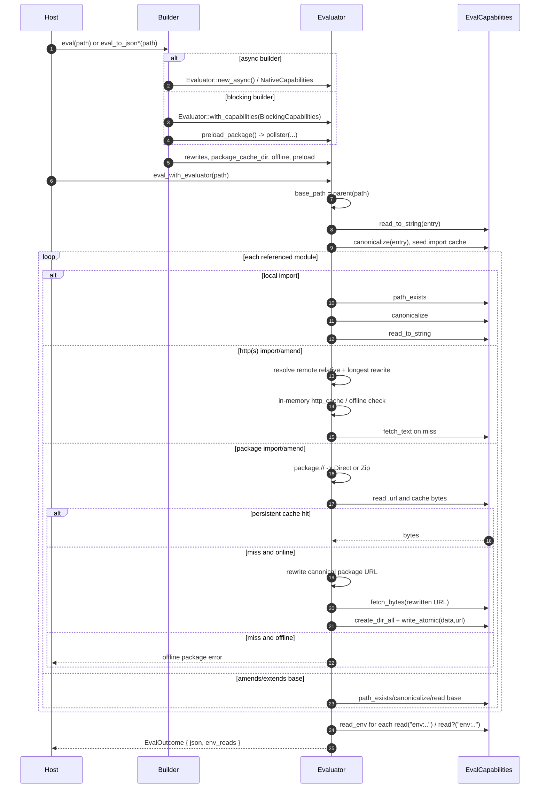

# pklr evaluate path audit

Audited commit: `2d60de508d321688f65a58422be39b858de7f499`. Line references are to this checkout; the executable trace is `tests/trace_capabilities.rs`.

## Public entry points

- The simple synchronous file API delegates to `EvaluatorBuilder::new().eval_to_json(path)` (`src/lib.rs:46`), while the asynchronous API delegates through the options-bearing async helper (`src/lib.rs:52`).
- The configured APIs expose the same four package controls on both builders: rewrites, persistent cache directory, offline mode, and preloaded package bytes (`src/lib.rs:83`, `src/lib.rs:95`).
- The async builder constructs `NativeCapabilities`, installs an optional reqwest client, applies rewrites/cache/offline, then awaits preloads (`src/lib.rs:161`). The blocking builder constructs `BlockingCapabilities`, applies the same evaluator settings in the same order, and invokes the synchronous preload wrapper (`src/lib.rs:240`).
- Both configured `eval` functions converge on the private `eval_with_evaluator` function: it sets `base_path` to the entry file parent, evaluates, applies output converters, and returns JSON plus the environment-read map (`src/lib.rs:324`).
- The blocking call is `pollster::block_on(eval_with_evaluator(path, self.build()))` rather than a second evaluator implementation (`src/lib.rs:263`).

## Capability boundary

`EvalCapabilities` is the host I/O boundary used by the evaluator. It requires string file reads, existence checks, path canonicalization, environment reads, text/byte fetches, temporary directories, and globs (`src/capabilities.rs:17`). Cache reads/writes, zip extraction, HTTP client replacement, and file deletion have default implementations but remain capability calls (`src/capabilities.rs:24`, `src/capabilities.rs:37`, `src/capabilities.rs:54`, `src/capabilities.rs:69`).

The evaluator stores the trait object and all mutable state—HTTP source cache, canonical local-module cache, module-scope snapshots, environment reads, in-flight scoped imports, extracted package directories, persistent cache directory, package HTTP roots, offline flag, and rewrites—in one `Evaluator` (`src/eval.rs:18`).

`NativeCapabilities` chooses Tokio filesystem operations when a Tokio handle is present and otherwise performs the same operation synchronously (`src/capabilities.rs:172`). `BlockingCapabilities` always uses `std::fs`, `std::env`, and ureq (`src/capabilities.rs:435`). Therefore the evaluator state machine is shared, but the default public builders do not install identical I/O adapters.

## Execution sequence



The actual sequence begins in `eval_file_pub`, which first clears per-run state, then reads the entry source through capabilities (`src/eval.rs:580`). `eval_source_inner` canonicalizes the entry and inserts an empty object placeholder before parsing and evaluation, and replaces that placeholder with the final value afterward (`src/eval.rs:563`).

This path is an in-process interpreter, not a Pkl subprocess protocol: after the host invokes `eval_file_pub`, the same future calls the lexer/parser and `eval_module_with_scope` directly (`src/eval.rs:569`, `src/eval.rs:572`). The arrows to “Pkl process” in the diagram are therefore requests made by pklr's evaluator state machine to the injected capability object, not OS process messages.

## Import and amend resolution

- Relative local references resolve against the current module's parent; `.../` inside an extracted package first resolves against that extracted package root, and elsewhere falls back to the entry `base_path` (`src/eval.rs:140`).
- A relative reference inside an HTTP/HTTPS module is joined through the `url` crate only when it has no scheme and the current path is HTTP/HTTPS; URLs already containing `://` and `pkl:` references bypass that join (`src/eval.rs:6525`). Dot segments are normalized by `Url::join` (`src/eval.rs:6536`).
- Imports are processed before `amends` in `eval_module_with_scope` (`src/eval.rs:779`, `src/eval.rs:975`). Before that pass, the evaluator computes referenced import aliases and recursively inspects amends/extends to avoid loading an import that is only used by an inherited base (`src/eval.rs:759`).
- Unused local imports are lazy: the code checks whether the alias is referenced before `path_exists` and before evaluating the module (`src/eval.rs:938`). Referenced local imports strip `file://`, otherwise call `resolve_local_path`, check existence, canonicalize through the cache path, then parse/evaluate (`src/eval.rs:933`, `src/eval.rs:950`, `src/eval.rs:589`).
- HTTP imports likewise skip absent aliases, then fetch and evaluate the remote module (`src/eval.rs:818`). Package imports resolve `package://`, strip the fragment's leading `/`, and choose direct source or zip extraction (`src/eval.rs:850`).
- `amends` uses the same remote-relative resolver (`src/eval.rs:978`). Local amends strip `file://` or resolve locally, call `path_exists`, evaluate the base with inherited scope, layer its module scope, and bind imports that refer to the same canonical base (`src/eval.rs:1055`, `src/eval.rs:663`, `src/eval.rs:6645`). It then loads the base source again through `load_module_source` to extract classes, converter configuration, and late properties (`src/eval.rs:1090`). The trace test observes this second base load after imports (`tests/trace_capabilities.rs:297`).
- `package://pkg.pkl-lang.org/github.com/<owner>/<repo>@<version>#/<file>` is a direct `.pkl` download rooted at `https://github.com/<owner>/<repo>/releases/download/<version>/` (`src/eval.rs:5722`). Pantry, generic GitHub download, and other generic package hosts resolve to zip URLs, and fragments reject empty paths, leading `/`, backslashes, and `..` components (`src/eval.rs:5735`, `src/eval.rs:5749`, `src/eval.rs:5758`, `src/eval.rs:5696`).

## Rewrites, caches, and offline

- Rewrite rules are parsed at builder/evaluator configuration time. Rules without `=` or with an empty source are filtered out and reported on stderr (`src/eval.rs:210`). Matching is prefix-based and selects the maximum source-prefix length (`src/eval.rs:249`).
- Ordinary HTTP source fetches rewrite before looking up the in-memory `http_cache`; the cache key is the rewritten URL. Offline is checked after that lookup, so a warm in-memory source can still be used offline, while a miss is refused before `fetch_text` (`src/eval.rs:299`).
- Direct package sources mark their release root in `package_http_roots`; subsequent relative files in that root bypass the ordinary HTTP rewrite path and use the package byte-cache path (`src/eval.rs:406`, `src/eval.rs:417`).
- Package bytes always attempt the persistent cache before network. A `.url` sidecar must equal the canonical, unrewritten URL and the data file must validate (`src/eval.rs:422`, `src/eval.rs:454`). Persistent paths are FNV-1a hashes under `<cache-dir>/packages/<16-digit-hash>.<ext>` with an adjacent `.url` sidecar (`src/eval.rs:5617`).
- On a valid persistent hit, package fetching returns without calling the network. On an invalid cache hit, offline returns the validation error; online removes the bad files and falls through. On an unreadable cache, online ignores the optimization and may fetch (`src/eval.rs:423`).
- On a persistent miss in offline mode, package loading fails with the canonical package URL and configured cache directory before rewriting or network access (`src/eval.rs:436`). Online package loading rewrites only at fetch time and calls `fetch_bytes` with the rewritten URL (`src/eval.rs:446`).
- A successful package download validates bytes as UTF-8 for `.pkl` or reads every zip entry for `.zip`, then best-effort writes data and URL sidecars (`src/eval.rs:448`, `src/eval.rs:5630`, `src/eval.rs:477`). Preload validates the supplied bytes and reports write failures, but it does not overwrite an already valid cache entry (`src/eval.rs:503`).
- Per-run caches and environment records are cleared by `begin_evaluation`; persistent package cache is not (`src/eval.rs:191`). The in-memory local `import_cache` is keyed by the path returned by `capabilities.canonicalize` and is reset per public evaluation (`src/eval.rs:589`, `src/eval.rs:193`).

## Environment and property feedback

- `read(uri)` evaluates the URI expression and invokes the resource dispatcher; `read?(uri)` uses the same dispatcher but maps any error to null (`src/eval.rs:3145`).
- `env:` calls `capabilities.read_env`, records the name and observed `Option<String>` in the evaluator's `BTreeMap`, and only then errors on `None` for mandatory `read` (`src/eval.rs:272`). Thus even a failed mandatory read leaves a record, while `read?` records the miss and returns null.
- `file://` and bare resource reads go through `read_to_string`; bare resources are joined to `base_path`, not to the current module (`src/eval.rs:268`, `src/eval.rs:291`). `prop:` is explicitly unsupported (`src/eval.rs:282`).
- Public outcomes move the map out through `take_env_reads`, so callers receive names sorted lexicographically by `BTreeMap`, independent of source execution order (`src/eval.rs:186`, `src/lib.rs:329`). The ordered execution trace still preserves the capability call order (`tests/trace_capabilities.rs:419`).

## Cycle protection

- Normal local imports canonicalize, return an existing cache entry on hit, and otherwise insert an empty object placeholder before recursive evaluation (`src/eval.rs:589`). A failure removes that placeholder; success replaces it with the final module value (`src/eval.rs:599`, `src/eval.rs:642`).
- Amends/extends use a separate `scoped_imports_in_flight` set because they carry inherited scope. A repeated canonical in-flight base returns an empty object, and the canonical key is removed when the nested evaluation exits (`src/eval.rs:654`).
- Depth is bounded by `max_depth = 32` before module evaluation proceeds (`src/eval.rs:720`).

## Synchronous/asynchronous audit

The blocking and async public builders are equivalent in the evaluator mechanics checked here: both apply rewrite, cache, offline, and preload settings before evaluation (`src/lib.rs:169`, `src/lib.rs:246`); both call the same `Evaluator` methods and persistent preload implementation (`src/lib.rs:174`, `src/eval.rs:521`); and both return through the same JSON/environment outcome constructor (`src/lib.rs:324`).

They are not literally constructed from the same capability type. Async uses `NativeCapabilities`, whose filesystem operations branch on Tokio runtime presence (`src/lib.rs:161`, `src/capabilities.rs:172`); blocking uses `BlockingCapabilities`, whose filesystem operations are always std and whose HTTP client is ureq (`src/lib.rs:240`, `src/capabilities.rs:435`). The trace test removes that adapter variable by installing the same fake `EvalCapabilities` for both execution styles (`tests/trace_capabilities.rs:221`). With that controlled boundary, the cold trace, preload/offline trace, and cycle trace are structurally compared and are equal (`tests/trace_capabilities.rs:367`, `tests/trace_capabilities.rs:440`, `tests/trace_capabilities.rs:506`).

No semantic divergence was found in path normalization, preload result reuse, environment-read recording, or cycle protection when the same capabilities are installed. I therefore did not invent a divergent minimal example. The only honest default-builder caveat is the capability/backend difference named above; the code provides no public builder hook for supplying a custom blocking `EvalCapabilities`, so direct public API tests cannot make that backend variable identical without using `Evaluator::with_capabilities` (`src/eval.rs:115`).

## Executable proof

`tests/trace_capabilities.rs` uses an in-memory `TraceCapabilities` and never accesses a registry, the real home cache, or real process environment variables (`tests/trace_capabilities.rs:50`). Its sample contains a local amend, a `file://` import, a direct package import, mandatory and optional environment reads, and two mutually importing cycle modules (`tests/trace_capabilities.rs:234`, `tests/trace_capabilities.rs:253`).

The test asserts:

- requested local paths are canonicalized to distinct normalized keys for entry, import, and amend (`tests/trace_capabilities.rs:390`).
- the longest package rewrite prefix wins and the byte fetch uses the mirror URL exactly once (`tests/trace_capabilities.rs:405`).
- cold package flow is ordered as cache URL read, lookup, miss, fetch, data write, and URL sidecar write (`tests/trace_capabilities.rs:297`).
- async and sync preloads produce equal traces and an offline cache hit, with zero byte fetches (`tests/trace_capabilities.rs:440`).
- a cold offline evaluator rejects the canonical package URL rather than contacting a network (`tests/trace_capabilities.rs:481`).
- environment calls preserve execution order and the returned JSON exposes the present, missing, and mandatory values (`tests/trace_capabilities.rs:376`, `tests/trace_capabilities.rs:419`).
- synchronous and asynchronous cycle runs produce equal values and capability traces (`tests/trace_capabilities.rs:506`).

Run only the proof with:

```sh
cargo test --all-features --test trace_capabilities
```
